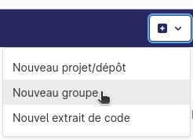

# TP n°1 : Annuaire (Modularité)

Dans ce TP, nous allons repartir d’un TP réalisé au S2 en Développement Orienté Objet pour revoir les notions de polymorphisme et appliquer celles de modularité.

## Outillage et démarrage

### Groupe

Commencez par *créer un groupe* dans lequel ranger l'ensemble des TP de R3.04.

<a></a>


### Fork

Sur ce dépôt, en plus du sujet (ce document), vous trouverez le code source de classes Java existantes desquelles nous allons repartir.

Créez une divergence (*fork* en anglais) de ce projet de manière à en avoir une copie sur un dépôt distant qui vous appartienne et sur lequel vous pourrez faire des modifications sans altérer l'original. 

<a></a>

Vous veillerez à bien utiliser le groupe créé précédemment.
<a></a>

### Clone

Depuis un terminal, positionnez vous dans le répertoire dans lequel vous avez choisi de ranger les TP de R3.04 dans votre session. Clonez le dépôt distant.

### Environnement de développement intégré

Pour réaliser ce TP, nous vous conseillons d'utiliser Eclipse comme Environnement de Développement Intégré (*IDE* en anglais).
Dans le cas où vous utilisez VS Code, pensez à installer l'*Extension pack for Java* si ça n'est pas déjà fait.

Ouvrez le projet dans votre IDE (en général, cela correspond au répertoire parent de *src*), ici **annuaire**. Si votre IDE ne le fait pas automatiquement, indiquez-lui quels sont les répertoires de sources du projet.

## Replongeons dans ce code

Note : Pour la pertinence de ce sujet, des adaptations ont été apportées à ce code qui ne correspond pas tout à fait à celui que vous aviez à faire au S2 mais en reprend les grandes lignes.

### Exécution et fonctionnalités

Un point de départ qui permet de se mettre dans le contexte est souvent de passer par une première exécution, en particulier si un main est disponible à cette fin. C'est aussi un moyen de s'assurer d'une configuration correcte de notre IDE et du fonctionnement au moins partiel du logiciel avant toute modification. 

### Documentation

Une manière d'appréhender le code en lui-même est de se référer à sa documentation (d'où l'intérêt de l'écrire...!). Ici, le code est plutôt bien documenté. 

Générez la documentation, cela peut être fait simplement en ligne de commande depuis le répertoire *annuaire* :

```
javadoc -d doc src/main/java/devoo/tp07/*.java
```

Explorez ensuite la documentation générée en partant du fichier index.html dans le répertoire *doc*.

### UML

Un autre outil qui peut être pratique pour appréhender un programme développé en langage objets est le diagramme de classes.

Dessinez sur une feuille, de préférence au crayon, le diagramme de classes correspondant au code fourni (sans les méthodes private) et montrez-le à votre enseignant pour un retour de sa part. L'idée ici est de faire remonter à la surface vos connaissances tout en vous familiarisant avec le code de ce TP.  

## Quelques améliorations

### Paquetages et modularité

Au S2, en Dév-oo, nous avions pris l'habitude de travailler au sein du même projet et d'associer à chaque sujet de tp un paquetage différent. Durant ce semestre, en qualité de développement, la règle générale sera que chaque sujet de TP constituera un projet à part entière. Ainsi, les paquetages serviront à l'architecture et à la modularité de votre code.

Dans cet esprit, nous allons ici commencer par réorganiser le code dans une optique d'API (*Application Programming Interface*). On sort donc de la dimension scolaire pour un nommage plus professionnel à visée universelle. On va donc inclure les classes présentes dans un paquetage **fr.univlille.phonebook**. Pour ce faire, on peut utiliser les outils de refactorisation de code, plus ou moins ergonomiques selon l'IDE, pour un renommage global sans aller changer chaque fichier "à la main".

À quoi la classe *ConsolePhoneBookManager* a-t-elle accès dans *PhoneBook* ?
Trouvez une solution de manière à mieux respecter le principe de modularité.

Une fois ces opérations effectuées, mettez à jour votre dépôt git distant en veillant à ne pas le polluer par d'éventuels fichiers non pertinents sur le dépôt. Vous pouvez reprendre vos cours précédents si vous avez oublié ou demander à votre enseignant.

#### Static

Dans la classe *ConsolePhoneBookManager*, différentes méthodes recourent à un même objet de manière relativement implicite. Cela ne respecte pas les principes de modularité. Réfléchissez à une solution de manière à éviter ce problème et proposez-la à votre enseignant avant de la mettre en oeuvre.

### Résolution de bug

Un bug a été signalé concernant l'application, il se produirait lorsqu'on veut consulter les coordonnées d'un correspondant absent de l'annuaire. Identifiez le problème et apportez lui une solution en terme de code et surtout de documentation. Une fois le correctif apporté, mettez à jour le dépôt distant.

### Qualité

Un des éléments majeurs pour augmenter la valeur du code et justement d'éviter la présence de bugs. Pour ce faire, recourez à des tests pertinents qui garantissent le bon comportement des méthodes.

Ici, des tests ont été réalisés pour la classe *PhoneNumber*. Réalisez-en pour les classes *ULillePhoneNumber* et *PhoneBook* afin de vous assurer du bon fonctionnement de ses méthodes dans divers scénarios. L'intérêt des tests est aussi de pouvoir détecter une éventuelle future erreur de manière automatisée (pour peu qu'on les exécute régulièrement), sans avoir à essayer "à la main" une série de scénarios.

Une fois vos tests réalisés, pensez de nouveau à mettre à jour votre dépôt distant. 
Dans la suite de ce sujet, il n'y aura plus d'indication concernant les commits à réaliser. Ça sera donc à vous d'aviser pour les effectuer de manière régulière et pertinente.

## Ajout de nouvelles fonctionnalités

### Intégration de la classe ULillePhoneNumber

Pour l'instant, à quel endroit la classe *ULillePhoneNumber* est-elle utilisée ? 
Pour répondre à cette question, les IDE proposent généralement une fonctionnalité permettant de lister les références via un clic droit sur la classe (ou la méthode) souhaitée.

Modifiez le logiciel pour qu'il soit désormais aussi possible d'ajouter un numéro interne à l'université à partir uniquement du département et du numéro de poste. Il s'agit d'un numéro plus court, uniquement constitué des 5 derniers chiffres, on considérera ici que les premiers sont les mêmes quelque soit le poste (ça n'est pas tout à fait vrai en réalité). 

Vous essaierez de faire en sorte que le numéro soit instancié comme interne qu'il soit saisi sous une forme ou une autre, par exemple *+33.3.59.03.21.06*, *03.59.03.21.06* ou *32106*.


### Affichage du numéro de poste interne

On vous a commandé l'ajout d'une nouvelle fonctionnalité : la récupération du numéro interne à l'Université.
Le scénario est le suivant : 
On souhaite passer un appel depuis l'Université vers un poste de l'Université. On récupére donc le numéro de poste interne plutôt que le numéro en entier. 
Implémentez cette fonctionnalité.

### Mise à jour de numéro de téléphone

Il arrive parfois qu'un poste change de numéro de téléphone. Dans ce cas, il faut pouvoir mettre à jour l'ensemble des contacts concernés en remplaçant l'ancien numéro par le nouveau. Réfléchissez à une solution pour ajouter cette fonctionnalité à l'application. Enrichissez votre diagramme de classes en conséquence et proposez-le à votre enseignant.

Après validation de votre enseignant, implémentez la fonctionnalité ainsi que les tests correspondants.


## Généralisation

L'application est aussi susceptible de servir pour d'autres universités, voire des entreprises, disposant elles aussi de numéros de postes internes. Les numéros internes de l'Université sont sur 5 chiffres mais il pourrait en être autrement pour d'autres structures. Qu'y a-t-il à changer dans notre prototype pour qu'il corresponde à ce besoin ?


Discutez-en avec votre enseignant puis effectuez ces modifications.

## Tests 

Implémentez des tests pour les parties du code qui ne sont pas couvertes actuellement (hors entrées/sorties). À noter qu'il existe des outils pour mesurer la couverture de code des tests. L'IDE Eclipse intègre cette fonctionnalité sans installation supplémentaire. Pour VS Code, moins *java-friendly*, il ne semble pas y avoir d'équivalent, y compris via les extensions. La pratique est de passer par un outil d'automatisation tel que maven (abordé au S4-S5). 

## Bonus

Choisissez une fonctionnalité à ajouter à votre application, réfléchissez à une solution en terme de conception puis essayez de l'implémenter.
