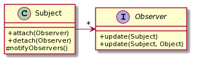
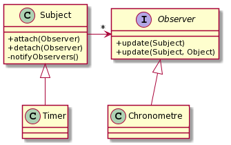

# TP4 - Observateur/Observé

Dans ce TP, vous allez vous familiariser avec les notions observateur/observé
notamment en implémentant les classes nécessaires puis en les utilisant pour
réaliser une horloge simple.

## Le patron Observateur / Observé

La figure suivante (Graphes UML réalisés grâce à `plantuml.com`) vous présente le patron Observateur (ici « Observer ») / Observé (ici « Subject »).
L’idée est qu’un observateur peut s’inscrire auprès d’un Observé et être avertis d’évènements qui se produisent sur l’Observé.
La méthode « update() » des Observateurs est déclenchée par l’Observé chaque fois qu’il veut prévenir d’un évènement.
Il utilise pour ça sa propre méthode « notifyObservers() ».



**Q1.1** Compléter la classe abstraite Subject de manière à pouvoir disposer du mécanisme Observateur/Observé.
Vérifiez la validité de votre implémentation à l'aide des tests fournis.

```java
package fr.univlille.iut.r304.tp4.q1;
public abstract class Subject {
  public void attach(Observer obs)
  public void detach(Observer obs)
  public void notifyObservers()
  public void notifyObservers(Object data)
}
```

Nous utiliserons ce pattern pour implémenter un (des) chronomètre(s).

On vous fournit la classe suivante (*TimerThread*) qui implémente un thread simple qui produit un évènement toutes les secondes.
Ce TimerThread permettra de déclencher la mise à jour des horloges qui afficheront l’heure.

```java
public class TimerThread extends Thread {
  @Override
  public void run(){
    while (true) {
      try {
        sleep(1000);
        // annoncer le « tick-horloge »
      } catch (InterruptedException e) {
        // on ignore et on espère que ce n’est pas grave
      }
    }
  }
}
```

Le thread s’utilise de cette façon : `new TimerThread().start();` (ce qui provoque l'appel à la méthode `void run()`) et boucle sans fin
en faisant une action (que **vous** devez définir) chaque seconde.

On souhaite instancier deux chronomètres, qui se mettent à jour toutes les secondes.
Ces deux chronomètres utiliseront le même Timer mais auront des temps écoulés différents (par simplicité, vous pouvez juste les initialiser à des valeurs différentes.





**Q1.2** Pour l’implémentation de Timer, on s’aperçoit d’un problème d’héritage.
Quelles sont les deux classes dont ce Timer devrait hériter ?

**Q1.3** Proposez une solution pour ce problème (c-a-d implémentez le Timer comme un Subject observable).
Implémentez aussi une classe chronomètre qui puisse être notifié par le Timer toutes les secondes et affiche le nombre de secondes écoulées.

```java
package fr.univlille.iut.r304.tp4.q1;
public class Timer
  public void start()
  public void stopRunning()
  ...
```
Note: Des tests sont fournis dans le projet pour que vous vous assuriez que vos classes fonctionnent comme attendu.
Respectez les noms des packages, classes et méthodes

**Q1.4** 
Lors des épreuves de course sportive, il n'est pas rare d'afficher en parallèle le chronomètre de l'étape et celui du temps total.
Dans cette idée, écrivez un main avec deux chronomètres console qui affichent simplement leur nom et le nombre de secondes écoulées en boucle, l'un démarrant à zéro, l'autre à une valeur saisie au départ.
On doit par exemple pouvoir dérouler le scénario suivant :

```
Temps chrono total (en secondes) : *3247*
etape : 1
total : 3248
etape : 2
total : 3249
...
```

**Optionnel** Implémentez un chronomètre en JavaFX qui affiche le nombre de secondes écoulées.
Une classe MainExample est là au besoin pour vous servir de base et commencer par vérifier la bonne configuration de JavaFX.
Notez que l'affichage JavaFX se fait dans un *thread* spécifique.
Pour que votre chronomètre JavaFX fonctionne, toute modification de l'affichage déclencée par un autre *thread* (ici le Timer) doit être fait par l'intermédiaire d'un appel à `javafx.application.Platform.runLater`,
Par exemple par une lambda telle que ceci :

```java
Platform.runLater( () -> { /* m-a-j affichage JavaFX */ } );
```
## Propriétés observables

JavaFX défini la notion de propriété observable (javafx.beans.value. ObservableValue) avec un mécanisme qui permet à un observateur d’être averti de tout changement d’état (i.e. de valeur) de la propriété (javafx.beans. property.Property).

À ceci s’ajoute les connexions qui permettent à des propriétés de s’observer mutuellement et que l’une réagisse automatiquement aux changement d’état (i.e. de valeur) de l’autre.

Il y a deux types de connexion entre les propriétés : mono ou bi-directionnelle.
La monodirectionnelle propage les changement d’une propriété (« source ») vers l’autre (« destination »), la bidirectionnelle propage les changements de n’importe laquelle des deux propriétés vers l’autre.

Ce sont des mécanismes pratiques mais qui obligent à importer JavaFX ce qui n’est pas toujours souhaitable dans un projet.
Vous devez réimplémenter ces mécanismes des propriétés.

**Q2.1** Rendez la classe ObservableProperty observable.
Outre le fait qu'elle soit observable (attach, detach), cette classe doit avoir une propriété à laquelle on peut accéder :

```java
package fr.univlille.iut.r304.tp4.q2;
public class ObservableProperty
  public Object getValue()
  public void setValue(Object val)
  ...
```

Bien sûr, le fait de changer la valeur de la propriété doit être notifié aux observateurs de celle-ci.

Notez que par simplicité, on utilisera une propriété de type `Object` (donc n'importe quel type).
Vous pouvez aussi définir une classe générique avec un type paramétrique pour typer cette propriété.

Vérifier la validité de votre implémentation en exécutant les tests associés à cette question.

**Q2.2** Créez la classe ConnectableProperty qui puisse se connecter de façon  mono ou bi-directionnelle :

```java
package fr.univlille.iut.r304.tp4.q2;

public class ConnectableProperty extends ObservableProperty
  public void connectTo(ConnectableProperty other)
  public void biconnectTo(ConnectableProperty other)
  public void unconnectFrom(ConnectableProperty other)
  ...
```

**QBonus** : Dans la partie 1 du sujet, ajouter un bouton permettant d'arrêter et redémarrer un chronomètre en particulier à tout moment.
