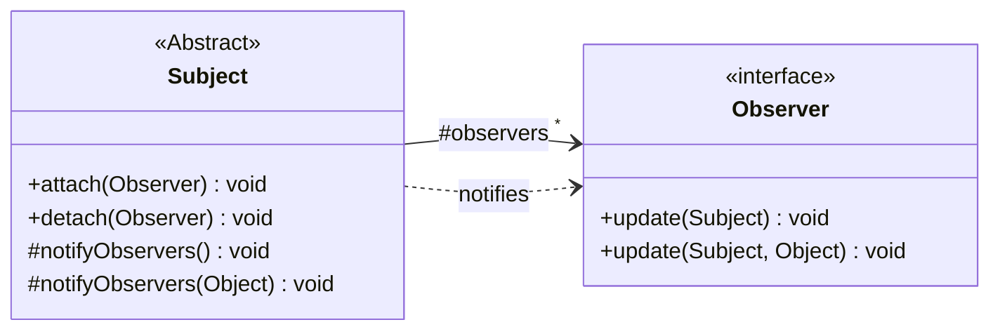
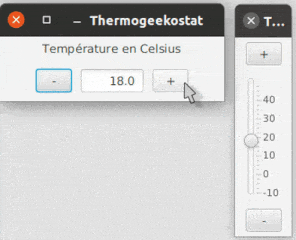
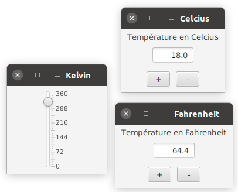

# TP5 : MVC avec le Thermo-geeko-stat

Dans ce TP vous allez approfondir votre compréhension du patron MVC (Modèle-Vue-Contrôleur) en implémentant ce patron sur une application très simple : un thermostat (de *geek*).

Ce patron se basant sur la notion d’Observateur/Observé, les classes du TP précédent sont disponibles dans le paquetage <code>fr.univlille.iutinfo.r304.utils</code> (ça peut au passage vous servir de correction).

Ce TP sera aussi l’occasion de réviser vos connaissances en JavaFX.
Vous pouvez utiliser la classe <code>JavaFXSimpleExample</code> fournie en exemple pour faire quelques essais préliminaires et vous remettre dans le bain. Si vous rencontrez des problèmes de configuration avec JavaFX, vous pouvez reprendre le TP2 à ce propos.

Des tests sont disponibles pour valider, au moins partiellement, vos implémentations au fur et à mesure du TP. Ils vont de pair avec l'énoncé pour votre bonne progression dans la réaliation de ce TP.

## Partie 1 : Un modèle, des vues

Un thermostat dans sa plus simple expression est un appareil ayant une température désirée et régulant le chauffage pour que la température réelle soit le plus proche possible de la température désirée.
On ne s’occupera bien sûr pas des capteurs et de la température réelle ici, ni du chauffage, mais seulement de pouvoir régler la température désirée.

On a donc un modèle et un affichage (vue + contrôleur) très simple.

**P1.Q1** Quel affichage est nécessaire pour seulement régler la température désirée ?

**P1.Q2** Que devrait contenir le modèle de l’application ?

Pour rappel, le modèle :
- Est indépendant de la (des) vue(s). Par exemple, pas de « import javafx » ;
- contient les données nécessaires à l’application ;
- contient aussi des comportements possibles sur ces données (mais sans s’occuper de l’affichage)

Donc quelle(s) donnée(s) doit contenir ce modèle ? Quel(s) comportement(s) ?

**P1.Q3** Faites une première version de l’application avec un modèle et un affichage simple.

On doit pouvoir voir la valeur désirée du thermo-geeko-stat, changer cette valeur par une autre, l’incrémenter ou la décrémenter de 1 degré à la fois.

*Optionnel* : Permettre aussi l’incrément/décrément de 5 en 5 (avec une interaction adaptée).

S’agissant d’une implémentation MVC, les communications du modèle vers la vue (l’affichage) doivent se faire suivant le patron observateur/observé (ici disponible dans <code>fr.univlille.iutinfo.r304.utils</code>. ).

Qui est ici l’observateur ? Qui est l’observé ?

Note : Puisque vous allez faire plusieurs vues (fenêtres) dans ce TP, il est plus pratique de ne pas utiliser le <code>PrimaryStage</code> que votre classe principale (qui hérite de Application) vous fournit dans la méthode <code>public void start(Stage primaryStage)</code>.
Il sera plus naturel que chaque vue créée sa propre instance de stage.

**P1.Q4** Avec une seule vue, ce patron est inutilement compliqué.
Mais si on a plusieurs vues (par exemple un thermostat à deux extrémités d’une grande pièce), l’utilisation de Observateur/Observé prend son sens.

Rajoutez maintenant une nouvelle vue (ou 2, ou 3) en créant simplement des nouveaux objets de la classe vue (une ligne Java).
Vérifiez que toutes les vues sont toujours synchronisées (affichent la même température désirée) grâce au MVC (et aux observateurs/observé).
On doit pouvoir aussi modifier la température en la saisissant directement dans le champs texte (d'une des vues). Dans ce cas aussi, toutes les vues doivent se mettre à jour.

*Optionel* : Créez une nouvelle vue utilisant un Slider pour afficher et modifier la température désirée.
On peut décider que les températures sont bornées entre -10.0 ⁰C et +30.0⁰C (même pour thermostat de *geek*).
Bien sûr, les anciennes vues doivent continuer à fonctionner.

## Partie 2 : Un modèle plus riche

Pour mériter véritablement son nom de thermostat *geek*, le themo-geeko-stat doit pouvoir accepter des températures dans n’importe quelle échelle de température.
La page [https://fr.wikipedia.org/wiki/Température](https://fr.wikipedia.org/wiki/Température) vous donnera les informations nécessaires sur toutes les échelles de températures existantes : Celsius, Delisle, Fahrenheit, Kelvin, Leyden, Newton, Rankine, Réaumur ou Rømer.

**P2.Q1** Nous allons implémenter toutes ces possibilités dans le type énuméré <code>Echelle</code>.
En plus de définir les constantes identifiant chaque échelle, ce type énuméré doit aussi associer un nom affichable (*i.e.* une String) à la constante et une abbréviation (« C » pour Celsius, ...).
Pour cela définissez-y des attributs, un constructeur et des getters. 

**P2.Q2** On veut pouvoir convertir les températures entre les différentes échelles.
Pour cela on vous propose d’utiliser un échelle « pivot » vers laquelle, et à partir de laquelle, toutes les autres pourront être converties.
On utilisera par exemple l’échelle Kelvin pour cela (mais n’importe quel autre choix serait possible).

Terminez en implémentant les méthodes 
- <code>double toKelvin(double value)</code>
- <code>double fromKelvin(double value)</code>

qui pour chaque échelle, transforment la valeur en paramètre en Kelvin ou de Kelvin vers l’échelle elle même.
Votre type Echelle est maintenant terminé.

**P2.Q3** Vous allez maintenant faire de la température une classe connaissant sa propre valeur (la température) et son échelle :
- <code>public Echelle getEchelle();</code>
- <code>public double getTemperature();</code>
- <code>public void setTemperature(double val);</code>
- <code>public void incrementTemperature();</code>
- <code>public void decrementTemperature();</code>

L’échelle est fixée à la création de l’objet Temperature (paramètre du constructeur).

Les méthodes travaillent directement dans l’échelle de l’objet.
C’est à dire par exemple que <code>incrementTemperature()</code> augmente de 1 degré dans l’échelle, ou que <code>setTemperature(0.0)</code> met au zéro de l’échelle considérée.

**P2.Q4** Finalement, les températures doivent être des propriétés connectables de telle façon que modifier la valeur d’une température (dans son échelle) mette à jour les températures qui lui sont connectées, chacune dans son échelle. 
Pour ce faire, on va pouvoir se resservir de la classe <code>ConnectacteProperty</code> du TP précédent, ici disponible dans <code>fr.univlille.iutinfo.r304.utils</code>.

## Partie 3. Un thermostat de *geek*

Vous allez maintenant joindre le tout pour que le thermo-geeko-stat puisse afficher et modifier sa température dans différentes fenêtres en différentes échelles.

**P3.Q1** Reprenez les fenêtres d’affichage faites à la question 1 et modifiez les pour qu’elles travaillent avec un modèle qui est une Temperature.
La fenêtre affichera son échelle en titre.

**P3.Q2** Créez plusieurs vues avec chacune une échelle différente, mais avec tous les modèles (températures) connectées entre elles.

Exemple d’affichage final :

*Optionel* : Ajoutez un menu qui permette de créer dynamiquement des nouvelles vues dans des échelles choisies.

*Optionel* : Ajoutez un menu qui permette de changer dynamiquement l'échelle d'une vue.
