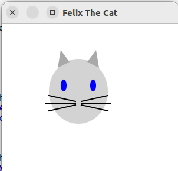
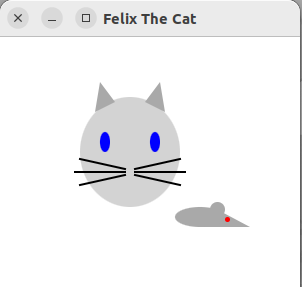
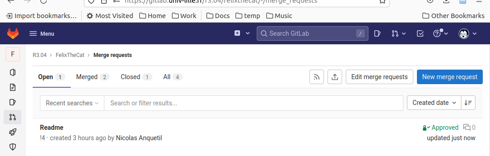
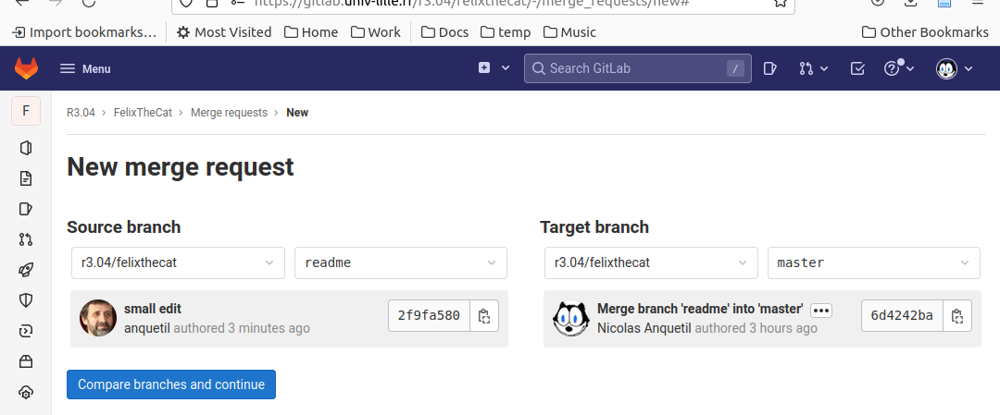
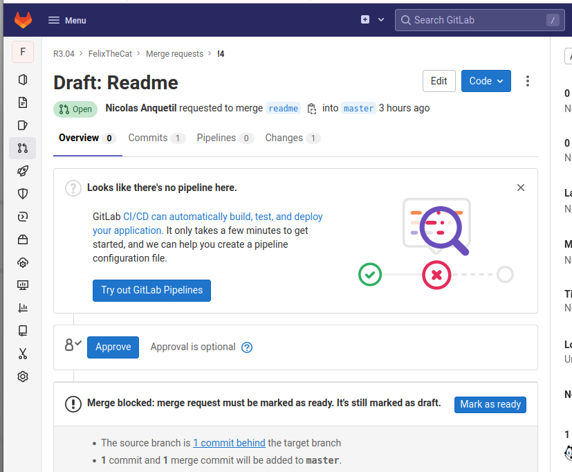
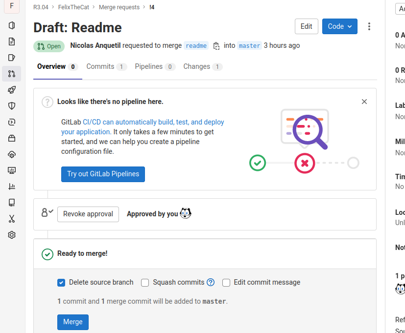

# TP n°2 : Pratique git

*Note : Ce TP participera à votre note d'UE6 dans cette ressource.*

Dans ce TP, vous allez mettre en pratique l’outil de gestion de version git, et notamment les branches.

L’exercice consiste à faire un programme a plusieurs en parallèle en utilisant les branches et le merge de git.
Nous vous imposons des contraintes qui sont existantes dans certains projets du « monde réel » (ex : projets open-source) et qui ont pour but de vous donner une expérience des commandes git.

## Règles du jeu

 - Le projet est à faire par groupe de 4 (éventuellement 5, exceptionnellement 3) ;
 - Vous ne pouvez pas communiquer oralement (situation courante d'un projet en groupe à distance);
 - Deux membres d’un groupe ne peuvent pas être voisins (pour éviter d'être tenter de déroger au point précédent) ;
 - Le projet est décomposé en plusieurs petites parties qui seront implémentées dans des méthodes différentes ;
 - Chaque membre du groupe travaillera sur sa propre branche puis fusionnera son travail (*merge*) sur la branche commune (master) ;
 - Vous ferez des commits et des push le plus souvent possible ;
 - Il y aura des conflits, c’est normal et cela fait parti de l’exercice.

 ## Mise en place

 ### Formation du groupe

Inscrivez au tableau votre nom sur un groupe en veillant bien à respecter les contraintes de taille et de voisinage.
|n°|    A    |    B    |    C    |    D    |   (E)   |
|--|---------|---------|---------|---------|---------|
|1 | Gael    | Leo     | Axelle  | Ylies   |         |
|2 | ...     | ...     | ...     | ...     | ...     |

 ### Configuration Git

Attention, toutes les opérations concernant votre dépôt local sont à réaliser en ligne de commande. Celles qui concernent le dépôt distant sont réalisées via l'interface web de gitlab.

1. Le membre A (et uniquement lui) crée une divergence (*fork*) du projet https://gitlab.univ-lille.fr/r3.04/felixthecat.git de visibilité interne
2. Le membre A octroie les droits de *owner* du projet aux membres B, C, D voire E et le rôle de *reporter* à l'enseignant de TP
3. **Tous** les membres du projet clônent **sur leur session** le projet **du groupe** (le *fork*), de manière à pouvoir faire des push par la suite sur le bon dépôt distant sans étape de configuration.
4. **Tous** les membres du projet créent **localement** une branche à leur nom et se positionnent dessus
```
git branch <nom-de-votre-branche>
git checkout <nom-de-votre-btranche>
```

## Utilisation de git : fichiers différents

Pas la peine d'ouvrir d'IDE pour l'instant, on va commencer à se familiariser à la manipulation de branches avec de simples fichiers textes.

### Premier push

Depuis sa branche en local donc, chaque membre du groupe va ajouter dans le répertoire doc un fichier *prenom-nom.txt* (nommé bien sûr en fonction de son prénom) et qui contiendra uniquement le nom de son langage préféré.
Une fois ceci fait, ajoutez votre fichier au suivi (via *git add*) puis faites immédiatement un commit sur votre branche avec un message significatif.

```
git commit -m "premiere implementation de …"
```
Il est désormais temps de partager votre mise à jour (*git push*). Vous devriez avoir une erreur, car votre branche n’existe pas sur le dépôt distant (*remote*). Une indication sur la commande à réaliser pour pouvoir procéder au *push* vous est alors proposée, suivez-la.

### Fusion (Merge)

Tous les membres d’une équipe doivent récupérer les modifications de leurs camarades. Dans la « vraie vie » une seule personne pourrait faire le travail pour tous. Ici, pour apprendre à le faire, tout le monde fera le même travail en parallèle.

Donc commencez par :

```
git pull
```

Naviguez entre les branches
```
git checkout <autre-branche>
``` 
pour vérifier que le répertoire doc contient bien des fichiers différents dans chaque branche.

Faites ensuite un merge dans la branche commune (master)
```
git checkout master
git merge <nom-de-la-branche-a-integrer>
```

Il ne devrait pas y avoir de conflit à ce stade (si personne n’a fait de push avant votre pull). Votre branche master devrait être un commit en avance de la branche du dépôt commun. Une fois que vous avez récupéré et fusionné l'ensemble des branches de vos collègues, vous pouvez partager la version unifiée.

```
git push
```

Au besoin, résolvez les conflits (voir plus bas).  Répétez les merges jusqu’à ce que tout le monde ait l'ensemble.

## Utilisation de git : même fichier, lignes différentes

Cette fois, on va expérimenter l'écriture dans un même fichier, sur des lignes différentes.
Répétez la procédure vue à l'étape précédente (en repartant de la création d'une branche) mais cette fois sur le présent fichier : *README.MD*
Chaque membre du groupe va compléter le fichier qui suit en ajoutant son prénom et son nom à la ligne qui lui correspond.

 A. Illies Douhab 
 B. Baptiste BERTOUT
 C. Manel
 D. Hocine CHEBOUT
 E. pierre planchon


## Utilisation de git : même classe, méthodes différentes (Felix the cat)

Dans l'étape qui suit, on va désormais tenter de co-éditer du code source JavaFx.
Attention, quelque soit l'éditeur que vous utiliserez, pensez à renseigner le .gitignore de manière à éviter de polluer le projet avec des fichiers de configuration. 

### Configuration IDE JavaFX

Cette partie du TP s'appuyer sur la bibliothèque JavaFX.
Cette *library* devrait déjà être présente sur les machines de TP dans /home/public/javafx-sdk-17.0.2.
Ci-dessous vous trouverez des consignes pour configurer Eclipse ou VS Code afin d'utiliser JavaFX sur celui-ci. Si vous utilisez un autre IDE, vous devriez savoir le configurer par vous même.

#### Configuration JavaFX pour Eclipse

Si vous utilisez Eclipse :

-  Créez une librairie « utilisateur » dans Eclipse : Window > Preferences > Java > Build path > User libraries > New…
Appelez la « javaFX » ;
 - Dans la bibliothèque créée, ajouter des « External JARs », selectionnez tous les jar de JavaFX dans le répertoire « /home/public/javafx-sdk-17.0.2/lib » (ou là ou vous avez décompressé l’archive) ;
 - Ajouter à votre projet la bibliothèque (clic droit sur le projet > Build path > Add librairy > User Library > javaFX) 
 - Lancer via Run Configuration en indiquant dans la zone de texte VM arguments 
 ```
 --module-path="/home/public/javafx-sdk-17.0.2" --add-modules=javafx.controls,javafx.fxml
 ```
Le programme devrait maintenant s’exécuter et afficher une fenêtre vide.

 #### Configuration JavaFX pour VS Code

Si vous utilisez VS Code :

L'utilisation de JavaFX nécessite d'adapter les fichiers de configuration du .vscode
À ce sujet, voir [cette page réalisée par Géry](https://gitlab.univ-lille.fr/gery.casiez/javafxvscodeconfig/-/blob/main/.vscode/launch.json)


### Dessinez, c'est fusionné

Créez les méthodes demandées dans Felix.java. Voici un exemple du résultat attendu. La qualité esthétique importe peu, c’est l’exercice git qui est important.

<a></a>

Chaque étudiant doit implémenter une méthode différente selon la répartition suivante :

|n°|    A    |    B    |    C    |    D    |   (E)   |
|--|---------|---------|---------|---------|---------|
|1 | *drawHead*    | *drawEyes*     | *drawEars*  | *drawWiskers*   | *drawNose* |

Un étudiant fait *drawHead*, un autre fait *drawEyes*, … dès que la première version est terminée, partagez-la comme précédemment.

### Conflits

En cas de conflit dans un *merge*, il faut ouvrir le fichier avec un conflit (ici : Felix.java) et intégrer à la main les différentes versions. Git ne peut pas décider tout seul ce qu’il convient de faire.
Vous pouvez travailler avec un éditeur de texte simple, ou avec un outil graphique (Eclipse, Meld, …). Essayez les deux pour voir et comprendre comment faire.
Il faut donc d’abord modifier le fichier « à la main » (décider quoi garder ou comment fusionner les différentes modifications), puis refaire un commit (un message de merge par défaut devrait vous être proposé).

### Replacement

Il peut y avoir des erreurs de placement des éléments. Faites une rotation des méthodes entre les participants (celui qui à fait la tête s’occupe des yeux, celui qui a fait les yeux s’occupe des oreilles,…) pour améliorer les positionnements.

## Pull/Merge Request

Vous devez maintenant intégrer votre code en utilisant un autre mécanisme : la Pull/Merge Request.
Commencez par apporter chacun une modification au code dans votre branche personnelle. Par exemple vous pouvez ajouter une souris avec les méthodes pour dessiner le corps, l’oreille, le nez, et l’œil (ou bien ajoutez au chat un chapeau, un nœud papillon, un nez, une bouche, un cigare,…).

<a></a>


Faites un commit et un push de vos modifications sur votre branche.

Dans gitlab allez sur le menu des « merge requests » (« Pull request » dans github) pour créer une nouvelle demande.

<a></a>

Indiquez votre branche (à merger dans master) et lancez la comparaison.

<a></a>


Demandez à un autre membre du groupe d’approuver votre requête (normalement après avoir vérifié que le code est correct). (Chacun devrait à tour de rôle approuver et merger une Merge Request).

<a></a>

Finalement, la requête peut être mergée. Attention à ne pas détruire votre branche dans ce cas.

<a></a>


Dans d’autres cas, on peut faire par exemple une branche pour corrigé un bug, et si la Pull/Merge Request est approuvée, on pourra détruire immédiatement cette branche.
